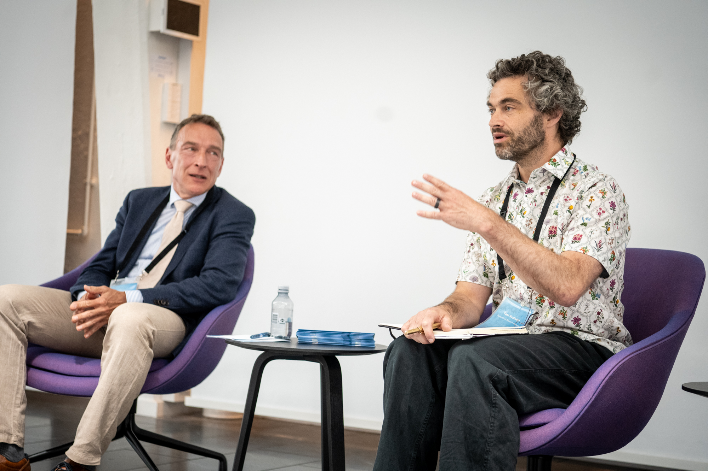
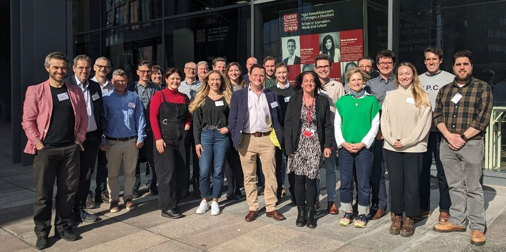
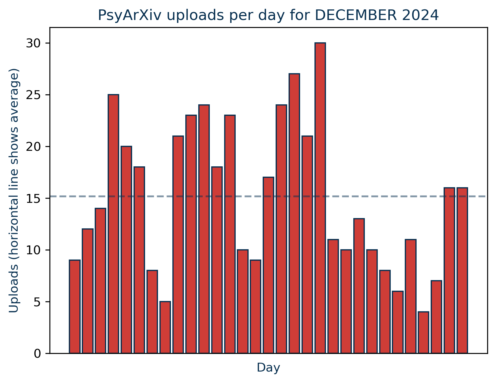
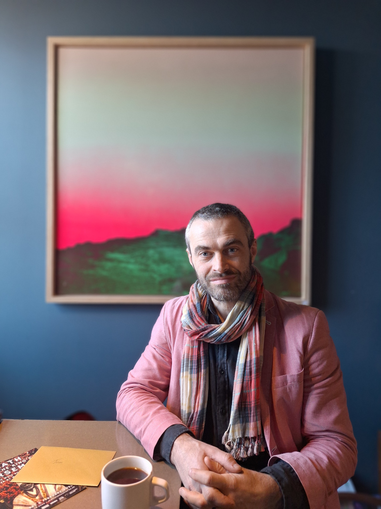

Recording things i've done which don't go under  [Papers](papers.html), 
[Talks](https://tomstafford.sites.sheffield.ac.uk/outputs/talks) or Newsletter: <https://tomstafford.substack.com/>. For current preoccupations, see [here](news.html).

## 2026

2026-02-02 to 2028-01-18 **Visiting Professor, Department of Computer Science and Technology, University of Cambridge**

2026-02-19: Letter published in Nature: [The funding system needs fixing — but it’s not a ‘waste of time and money’](https://doi.org/10.1038/d41586-026-00498-9)
  - see also [The point of no return?](https://researchonresearchinstitute.substack.com/p/the-point-of-no-return)

2026-01-28: Chaired workshop on Demand Management at Wellcome Trust

2026-01-02: Published [The 1,000 neuron challenge](https://www.thetransmitter.org/computational-neuroscience/the-1000-neuron-challenge/) at The Transmitter. 'A competition to design small, efficient neural models might provide new insight into real brains—and perhaps unite disparate modeling efforts.'

## 2025

2025-12-18: Published [A new model moves research in a more democratic direction – it could be faster and fairer too](https://wonkhe.com/blogs/a-new-model-moves-research-in-a-more-democratic-direction-it-could-be-faster-and-fairer-too/) at WonkHE, with Anna Butters.

2025-10-25: Participated in the [ARRC](https://www.arrc.group.cam.ac.uk/) policy studio on ECR precarity, at the University of Cambridge, UK. 

September 2025: [Our working paper on Distributed Peer Review published](https://doi.org/10.6084/m9.figshare.29994841). Media: [LSE Impact Blog](https://blogs.lse.ac.uk/impactofsocialsciences/2025/09/18/distributed-peer-review-how-the-wisdom-of-the-crowd-can-allocate-grant-funding/), [Science|Business](https://sciencebusiness.net/news/r-d-funding/assessment/distributed-peer-review-cuts-funding-decision-time-trials-show-there-are-risks), [Research Professional News](https://www.researchprofessionalnews.com/rr-news-europe-universities-2025-8-radical-method-cuts-time-on-peer-review-by-60-trial-finds/), [LaborJournal](https://www.laborjournal.de/editorials/3323.php), [Table](https://table.media/research/analyse/distributed-peer-review-welche-probleme-das-verfahren-loest) and [my newsletter](https://tomstafford.substack.com/p/distributed-peer-review)

2020 - 2025 I was **[Research Practice Lead](done/2025rpl.html)** for the University of Sheffield

2025-07-31 Published (late!) the [showcase for this year's class of PSY6422 Data Analysis and Visualisation](https://tomstafford.github.io/psy6422/class-of-2025.html) (check out previous year's showcases on [the course pages](https://tomstafford.github.io/psy6422))

2025-07-01 Science runs a story on our work on Distributed Peer Review: [Should grant applicants judge competitors’ proposals? Unorthodox approach gets two real-world tests](https://www.science.org/content/article/should-grant-applicants-judge-competitors-proposals-unorthodox-approach-gets-two-real) doi: 10.1126/science.zap69fh

2025-07-01 Quoted in Nature for this story on Distributed Peer Review: [How to speed up peer review: make applicants mark one another](https://www.nature.com/articles/d41586-025-02090-z). Nature 643, 313-314 (2025) doi: https://doi.org/10.1038/d41586-025-02090-z

June 29th: Helped organise and run ECR Metascientst Happy Hour, a networking event before Metascience 2025 hosted by the UKRN. Report: [How to make a career in Metascience: Advice from Experts](https://www.ukrn.org/2025/07/04/ecr-metascientist-happy-hour/)

June 16-18th: Panel DPR on DPR at International Conference on the Science of Science and Innovation ([ICSSI](https://icssi.org/)), Copenhagen. Here's me and Anders Smith from Villum Fonden

June: Stafford, T., Pinfield, S., Butters, A., & Benson Marshall, M. (2025). RoRI Insights: Applicants as reviewers - a Guide to Distributed Peer Review (Version 1). Research on Research Institute. <https://doi.org/10.6084/m9.figshare.29270534.v2>

May : external advisor and auditor for UKRI's first trial of Distributed Peer Review (read about this in their report [A Year in Metascience](https://www.gov.uk/government/publications/a-year-in-metascience-2025), published 2025-06-30)

May - June: [AFIRE Sprint on AI in grantmaking](https://researchonresearch.org/afire-ai-in-funding-sprint/)

May 2025: Launch of the [Editors and Publishers Network](https://sheffield.ac.uk/openresearch/home/editors-and-publishers-network) at the University of Sheffield, following the event I convened in 2024.

2025-05-21 Final of our 2024-25 [AFIRE Funder Forum](https://researchonresearch.org/afire-funders-forum/) series; showcasing experiments by research funders. Talk recordings are on the website, as well as the [RoRI YouTube channel](https://www.youtube.com/@researchonresearchinstitut6175).

April 2025: Attended [Fostering Accountability for the Integrity of Research Studies (FAIRS)](https://www.sjcfairsmeeting.com/), St John's College, Oxford

2025-03-04: Chaired the [UKRN](https://www.ukrn.org/) Institutional Leads retreat in Cardiff. Here we are:

2025-01-14: republished on the LSE Impact Blog [Do Community Notes work?](https://blogs.lse.ac.uk/impactofsocialsciences/2025/01/14/do-community-notes-work/)

## 2024

2024-12-23: Made a webscraping bot on mastodon: [https://mastodon.social/@PAXscraper](https://mastodon.social/@PAXscraper), which reports stats from PsyArXiv:

2024-12-19: Kate took this picture in [Elm](https://www.elmsheffield.co.uk/)

2024-11-28/29: Represented [UKRN](https://www.ukrn.org/) at the [Swiss National Science Foundation](https://www.snf.ch/en)'s Research on Research Conference, Bern. 

2024-10-23: Inaugural event of the [AFIRE Funder Forum](https://researchonresearch.org/afire-funders-forum/)

2024-10-07: Nature editorial on our project with VolkswagenStiftung: [New peer-review trial lets grant applicants evaluate each other’s proposals](https://www.nature.com/articles/d41586-024-03106-w)

2024-09: Trip to China. News story on this: [Navigating Research Culture and Funding Practices: Highlights from Shanghai](https://researchonresearch.org/shanghai-forum-tom-stafford-afire/)

2024-08-30: Article in New Scientist with Kate Dommett: [Is digital technology really swaying voters and undermining democracy?](https://www.newscientist.com/article/mg26335062-800-is-digital-technology-really-swaying-voters-and-undermining-democracy/). My [newsletter on this](https://tomstafford.substack.com/p/the-truth-about-digital-propaganda)

2024-06-21: Research Matters magazine (with Shaun Leamon): [Experiments in research funding to reduce research bureaucracy](https://the-sra.org.uk/common/Uploaded%20files/Research%20Matters%20Magazine/sra-research-matters-june-2024-edition.pdf) 

2024-06-18: Early results from our project with Volkswagen Foundation: [Researchers optimistic about Distributed Peer Review](https://researchonresearch.org/dpr-volkswagen-foundation-first-results/)

2024-06-17: Hosted [AI replication game](https://sites.google.com/sheffield.ac.uk/orwg/research-practice) at University of Sheffield with the [Institute for Replication](https://i4replication.org/)

2024-05-23: Organised networking event for [University of Sheffield editors](https://sites.google.com/sheffield.ac.uk/orwg/research-practice)

2024-06-21: [2024 Showcase for Data Analysis and Visualisation MSc Students](https://tomstafford.github.io/psy6422/class-of-2024.html)

Febuary 2024: Oliver Bray shared his MSc project: Bray, O. J., & Stafford, T. (2024, February 5). [No Far-Transfer from Ten Years of Feedback on Task Length Estimation: A Case Study](https://osf.io/preprints/psyarxiv/fsr53). https://doi.org/10.31234/osf.io/fsr53.
  - see also [Ollie's blog: Can Feedback Improve Your Productivity Estimates? Data from a 10-Year Case Study
Ollie Bray](https://shinkai0202.github.io/PSY6009_Research_Project/)

2024-01-03: BBC Future article [Tetris: How a US teenager achieved the 'impossible' and what his feat tells us about human capabilities](https://www.bbc.co.uk/future/article/20240103-tetris-how-a-us-teenager-achieved-the-impossible)

## 2023

December 2023 : joined the PsyArXiv Scientific Advisory Board and approved as chair of the public engagement subcommittee. <https://osf.io/preprints/psyarxiv>

2023-11-10; Worked with Lingyu-Meng on a novel visualisation of how group discussion shifts people's opinions : <a href="Dynamics of group discussion in agreement-error space">https://lingyu-meng.github.io/convergence-valence_space/</a>

2023-11-07-: elected **Chair of UKRN Institutional Leads group**

Sept 2022 - Sept 2023 Coordinator for UKRN [Open Research programme](https://www.ukrn.org/open-research-programme/), [workstream 1: training](https://www.ukrn.org/ws1-training/)

2023 August made <https://tomstafford.github.io/imdb/>, showing change in crowdsourced ratings of summer movies:

2023 July Consulted on [University of Sheffield Guidelines on Generative AI](https://sheffield.libguides.com/genai/)

2023-05-23 Analysis of Open Editors data: <https://tomstafford.github.io/editors/>

2023 onwards: member of University of Sheffield Research Culture Steering Board, which provides leadership and coordination for the development of institutional research culture.

2023-05-18 Chaired UKRN/RoRI panel on [The Future of Peer Review](https://www.ukrn.org/event/future-of-peer-review-may2023/). ([Recording](https://youtu.be/BMeSh6esehE) and DOI:[10.52843/cassyni.50wy02](https://doi.org/10.52843/cassyni.50wy02), [Slides](https://osf.io/ce3ts/))

2023-05-05 Co-author on UKRN working paper on [Open Research Training Resources and Priorities](https://osf.io/s2f6k/), ([news item](https://www.ukrn.org/2023/05/05/ukrn-first-working-paper-on-training-priorities-and-resources/))

2023-05-10 Cited in Science, Innovation and Technology Committee report on [Reproducibility and research integrity](https://publications.parliament.uk/pa/cm5803/cmselect/cmsctech/101/summary.html). Written evidence:[Commercial involvement in academic publishing is key to research reliability and should face greater public scrutiny](https://osf.io/preprints/metaarxiv/rjmvh)

2023-04-15 Chaired [Straight to the Facts: Can we save public debate? A dialogue with Will Moy](https://www.eventbrite.co.uk/e/straight-to-the-facts-can-we-save-public-debate-a-dialogue-with-will-moy-tickets-546336496167)

2023-02-19 Updated my minimal working example of RMarkdown + papaja + tenzing for APA formatted manuscript preparation, to include a rights retention statement : <https://github.com/tomstafford/rmarkdown_apa>

2023-02-06 Teaching my MSc course in Data Management and Visualisation. Materials, all CC-BY, and containing many links and resources on all things research project management, data wrangling and #dataviz  here <https://tomstafford.github.io/psy6422/>

2023-02-01 and forever: taking part in [UCU strike action](https://mastodon.online/@tomstafford/109788334770383538)

2023-01-24 Attended launch of [N8 Research Partnership stands up for researchers with new Rights Retention statement](https://www.n8research.org.uk/n8-research-partnership-rights-retention-statement/)

2023-01-17 Celebrating [University of Sheffield announcing rights retention policy](https://www.researchprofessional.com/0/rr/news/uk/universities/2023/1/University-of-Sheffield-approves-policies-to-bolster-open-research.html)

2023-01-16 Retired the [Choice Engine](https://tomstafford.github.io/choice-engine-text/) bot

2023-01-09 Graduation for Psychological Research Method with Data Science MSc [class of 2021](https://mastodon.online/@tomstafford/109659193946308768)

2023-01-06 Updated: Experiment Design Checklist <https://tomstafford.github.io/psy-checklist/>

2023-01-01 [Archive of tweets 2008-2022](https://idiolect.org.uk/tweets/)

# 2022

2022-08-29 News: [Advanced notice: Research On Research Institute seeks postdocs](done/2022-08-29_news_advanced-notice-research-on-research-institute-seeks-postdocs.qmd)

2022-12-25 News: [Christmas Message 2022](done/2022-12-25_news_christmas-message-2022.qmd)

Probably I did other things this year, but the only thing I can find a note of is

2022-03-09 Released code for making your own ['hybrid images'](https://github.com/tomstafford/hybridimages). They look different from different distances (vision science people: it is about putting different image information into different spatial frequencies)

# 2021

2021-01-26 News: [PhD opportunity: Informing citizens?](done/2021-01-26_news_phd-opportunity-informing-citizens.qmd)

2021-11-25 News: [Job: Open Research Training Lead](done/2021-11-25_news_job-open-research-training-lead.qmd)

2021 onwards: member, University of Sheffield Open Research Advsory Group, "providing strategic leadership in the ongoing development, promotion and implementation of the policies and practices supporting the University’s commitment to Open Research"

2021 to 2024: member of University of Sheffield Research Excellence Working group, which developed, consulted on and agreed a common definition and understanding of ‘excellence’ for use alongside the institutional research strategy.

2021: [The Experiment Design Checklist](https://tomstafford.github.io/psy-checklist/)

Led development and adoption of the [University of Sheffield statement on Open Research](https://www.sheffield.ac.uk/openresearch/university-statement-open-research)

# 2020

2020-07-08 News: [Understanding online political advertising](done/2020-07-08_news_understanding-online-political-advertising.qmd)

2020-09-03 News: [Engaging dialogue generated from argument maps](done/2020-09-03_news_engaging-dialogue-generated-from-argument-maps.qmd)

2020-09-09 News: [Research Practice Lead for the University of Sheffield](done/2020-09-09_news_research-practice-lead-for-the-university-of-sheffield.qmd)

2020: [The Letters of Pope Gregory VII - pilot project](https://figshare.com/articles/dataset/The_Letters_of_Pope_Gregory_VII_-_pilot_project/12781049) (with Charles West and George Litchfield)

2020 onwards: member, University Vice President for Research's Strategy Group (VPSG)

# 2019

2019-01-15 News: [Remarks at 'Re-energising the narrative: Human rights in the digital age'](done/2019-01-15_news_remarks-at-re-energising-the-narrative-human-rights-in-the-digital-age.qmd)

[Animated Itinerary of King John,](https://sites.google.com/d/1nQb4g6jqk7M0gwaD4Bvw7QKtBg0nkQRV/p/120fMmXEkjhEwEnsgf8fx5v1XKQrf3MdZ/edit)  [Mapping The Itinerary of King Edward I](https://figshare.com/articles/dataset/Mapping_The_Itinerary_of_King_Edward_I/8948699), [Mapping Papal Letters](https://tomstafford.github.io/PapalCorrespondence/) (with Charles West)

# 2018

2018-01-02 News: [Reproducibility](done/2018-01-02_news_reproducibility.qmd)

2018-04-30 News: [Symposium on Robust Research Practices](done/2018-04-30_news_symposium-on-robust-research-practices.qmd)

2018-06-16 News: [Teaching: How reliable is cognitive neuroscience?](done/2018-06-16_news_teaching-how-reliable-is-cognitive-neuroscience.qmd)

2018-06-20 News: [Quit while you're ahead](done/2018-06-20_news_quit-while-youre-ahead.qmd)

2018-08-14 News: [Preprints](done/2018-08-14_news_preprints.qmd)

2018-09-20 News: [The Choice Engine](done/2018-09-20_news_the-choice-engine.qmd)

2018: [@ChoiceEngine - an interactive essay about the psychology of free will](https://github.com/tomstafford/choice-engine-text)

# 2017

2017-11-01 News: [Seminar - Framing effects in the field: Evidence from two million bets](done/2017-11-01_news_seminar-framing-effects-in-the-field-evidence-from-two-million-bets.qmd)

2017-11-09 News: [Pre-registration](done/2017-11-09_news_pre-registration.qmd)

2017-11-09 News: [The Open Science Framework](done/2017-11-09_news_the-open-science-framework.qmd)

2017-12-01 News: [Funded PhD studentship](done/2017-12-01_news_funded-phd-studentship.qmd)

2017-12-14 News: [Cyberselves: How immersive technologies will impact our future selves](done/2017-12-14_news_cyberselves-how-immersive-technologies-will-impact-our-future-selves.qmd)

2017-12-27 News: [2017 review](done/2017-12-27_news_2017-review.qmd)

2017-11-09: Open science essentials in two minutes [pre-registration](done/2017-11-09prereg.html)

2017 to 2021: member, University of Sheffield Open Access Advisory Group, representing Faculty of Science, providing strategic overview of scholarly communication

2017 Organised [Mind Matters](https://tomstafford.sites.sheffield.ac.uk/sub-sites/mind-matters) 'a series of events based on various psychological research to bring knowledge to the general public and showcase Sheffield as a hub for psychology!'

2015 Data Scientist in Residence at [folksy.com](folksy.com). See [Folksy data analysis: buyer decision time](http://blog.folksy.com/2015/03/09/folksy-data-analysis-buyer-decision-time)

2012 - 2017 Wrote a column for [BBC Future](https://www.bbc.com/future/columns/neurohacks)

# Earlier

## 2016

2016-03-16 News: [Dangers and advantages in the idea of implicit bias](done/2016-03-16_news_dangers-and-advantages-in-the-idea-of-implicit-bias.qmd)

2016-06-07 News: [A hierarchy of critique](done/2016-06-07_news_a-hierarchy-of-critique.qmd)

2016-06-16 News: [New paper: Improving training for sensory augmentation](done/2016-06-16_news_new-paper-improving-training-for-sensory-augmentation.qmd)

2016-07-04 News: [Why don't we trust the experts?](done/2016-07-04_news_why-dont-we-trust-the-experts.qmd)

2016-07-05 News: [We are European scholars](done/2016-07-05_news_we-are-european-scholars.qmd)

2016-08-08 News: [Cognitive Science Conference, Philadelphia](done/2016-08-08_news_cognitive-science-conference-philadelphia.qmd)

2016-10-12 News: [CogSci @ Sheffield](done/2016-10-12_news_cogsci-sheffield.qmd)

2016-10-12 News: [Internship: Public engagement coordinator](done/2016-10-12_news_internship-public-engagement-coordinator.qmd)

2016-10-21 News: [Using Candy Crush to study perceptual learning](done/2016-10-21_news_using-candy-crush-to-study-perceptual-learning.qmd)

2016-12-20 News: [2016 review](done/2016-12-20_news_2016-review.qmd)

## 2015

2015-06-19 News: [Power analysis for a between-sample experiment](done/2015-06-19_news_power-analysis-for-a-between-sample-experiment.qmd)

2015-09-02 News: [Bias mitigation](done/2015-09-02_news_bias-mitigation.qmd)

2015-12-02 News: [Crowdsourcing analysis, an alternative approach to scientific research](done/2015-12-02_news_crowdsourcing-analysis-an-alternative-approach-to-scientific-research.qmd)

2015-12-15 News: [Individualised student feedback](done/2015-12-15_news_individualised-student-feedback.qmd)

2015-12-16 News: [2015 review](done/2015-12-16_news_2015-review.qmd)

## 2014

2014-01-01 News: [Tracing the trajectory of skill learning with a very large sample](done/2014-01-01_news_tracing-the-trajectory-of-skill-learning-with-a-very-large-sample.qmd)

2014-03-12 News: [First visualise, then test](done/2014-03-12_news_first-visualise-then-test.qmd)

2014-03-12 News: [New paper: Performance breakdown effects dissociate from error detection](done/2014-03-12_news_new-paper-performance-breakdown-effects-dissociate-from-error-detection.qmd)

2014-08-07 News: [New paper: Wiki users get higher exam scores](done/2014-08-07_news_new-paper-wiki-users-get-higher-exam-scores.qmd)

2014-09-16 News: [Teaching: What it means to be critical](done/2014-09-16_news_teaching-what-it-means-to-be-critical.qmd)

2014-09-30 News: [New grant - Reduced habitual intrusions: an early marker for Parkinson's?](done/2014-09-30_news_new-grant-reduced-habitual-intrusions-an-early-marker-for-parkinsons.qmd)

2014-10-20 News: [Event: Crowdsourcing psychology data - online, mobile, big data approaches](done/2014-10-20_news_event-crowdsourcing-psychology-data-online-mobile-big-data-approaches.qmd)

2014-12-01 News: [Neuroimaging as a marker of attention deficit hyperactivity disorder (ADHD)](done/2014-12-01_news_neuroimaging-as-a-marker-of-attention-deficit-hyperactivity-disorder-adhd.qmd)

## 2013

2013-02-04 News: [Six clear writing tips for exam success](done/2013-02-04_news_six-clear-writing-tips-for-exam-success.qmd)

2013-02-18 News: [New paper: The path to learning: Action acquisition is impaired](done/2013-02-18_news_new-paper-the-path-to-learning-action-acquisition-is-impaired.qmd)

2013-07-03 News: [New paper: The discovery of novel actions](done/2013-07-03_news_new-paper-the-discovery-of-novel-actions.qmd)

2013-07-05 News: [The department's first Director of Public Engagement](done/2013-07-05_news_the-departments-first-director-of-public-engagement.qmd)

2013-09-12 News: [No learning where to go without first knowing where you're coming from](done/2013-09-12_news_no-learning-where-to-go-without-first-knowing-where-youre-coming-from.qmd)

2013-09-27 News: [New PhD Student: Angelo Pirrone](done/2013-09-27_news_new-phd-student-angelo-pirrone.qmd)

2013-12-18 News: [New project - Bias and blame](done/2013-12-18_news_new-project-bias-and-blame.qmd)

## 2012

2012-12-21 News: [Three PhD studentships in decision making](done/2012-12-21_news_three-phd-studentships-in-decision-making.qmd)

2012-12-03 News: [New paper: Memory enhances the mere exposure effect](done/2012-12-03_news_new-paper-memory-enhances-the-mere-exposure-effect.qmd)

2012-11-27 News: [Frontiers special issue on intrinsic motivation and open-ended development](done/2012-11-27_news_frontiers-special-issue-on-intrinsic-motivation-and-open-ended-development.qmd)

2012-10-30 News: [Brain network: Social media and the cognitive scientist](done/2012-10-30_news_brain-network-social-media-and-the-cognitive-scientist.qmd)

2012-10-24 News: [Project LongArm: Drawing Machines](done/2012-10-24_news_project-longarm-drawing-machines.qmd)

2012-09 I wrote some of the code in LongArm, [a robot which draws labrynthine patterns](https://www.youtube.com/watch?v=lSuvSsDrEAw), by Matthias Jones

2012-09-06 [Wall Street Journal cover](done/2012-09-06_news_wall-street-journal-cover.qmd). The Cognitive Science Safari] was a street-tour of classic social psychology experiments, in Berlin as part of the BMW Guggenheim Lab. I was on the cover of the Wall Street Journal.

https://tomstafford.github.io/images/
2012-06-04 News: [New paper: A novel task for the investigation of action acquisition](done/2012-06-04_news_new-paper-a-novel-task-for-the-investigation-of-action-acquisition.qmd)

2012-06-06 News: [Fundamentals of learning: the exploration-exploitation trade-off](done/2012-06-06_news_fundamentals-of-learning-the-exploration-exploitation-trade-off.qmd)

## 2011

2011: [The Tea Taste Test](https://sites.google.com/d/1nQb4g6jqk7M0gwaD4Bvw7QKtBg0nkQRV/p/1O7uZnZPiKBL7C6JiR0DLSgGCqVw86uYX/edit) -- explaining why statistics are important to psychology, using a controversy of how to make a cup of tea.