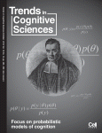

# Brain network: Social media and the cognitive scientist 

[Back to News](/news)

30 October 2012

This article was just published in [*Trends in Cognitive Sciences*](http://www.sciencedirect.com/science/article/pii/S1364661312001775#).

Abstract:

Cognitive scientists are increasingly using online social media, such as blogging and Twitter, to gather information and disseminate opinion, while linking to primary articles and data.

Because of this, internet tools are driving a change in the scientific process, where communication is characterised by rapid scientific discussion, wider access to specialist debates and increased cross-disciplinary interaction. This article serves as an introduction to and overview of this transformation.

Reference: Stafford, T., and Bell, V. (2012). Brain network: Social media and the cognitive scientist. *Trends in Cognitive Sciences*, 16(10), 489--490. doi:10.1016/j.tics.2012.08.001

I'm on Twitter as [\@tomstafford](http://twitter.com/tomstafford), btw

