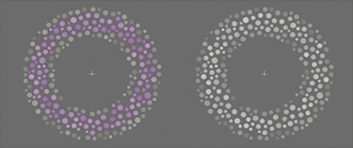

# New paper - The path to learning: Action acquisition is impaired when visual reinforcement signals must first access cortex 

[Back to News](/news)

18 February 2013

[Using cunning experimental design we provide evidence which supports a new theory of how the brain learns new actions](http://www.sciencedirect.com/science/article/pii/S0166432813000429). Back in 2006, Professors Redgrave and Gurney [proposed a new theory](http://www.nature.com/nrn/journal/v7/n12/abs/nrn2022.html) of how the brain learns new actions, centred around the subcortical brain area, the basal ganglia and the function of the neurotransmitter dopamine.

This was exciting for two reasons: it proposed a theory of what these parts of the brain might do, based on our understanding of the pathways involved and the computations they might support and because it was a theory that was in flat contradiction to the most popular theory of dopamine function, the [reward prediction error hypothesis](http://www.sciencemag.org/content/275/5306/1593.short).

We set out to test this theory. We used a [novel task to assess action-outcome learning](http://www.plosone.org/article/info%3Adoi%2F10.1371%2Fjournal.pone.0037749), in which human subjects moved a joystick around until they could identify a target movement. We didn't record the dopamine directly - a tall order for human subjects - but instead used our knowledge of what triggers dopamine to compare two learning conditions: one where dopamine would be triggered as normal, and one where we reasoned the dopamine signal would be weakened.

We did this by using two different kinds of reinforcement signals, either a simple luminance change (ie a white flash), or a specifically calibrated change in colour properties (visual psychophysics fans: a shift along the tritan line). The colour change signal is only visible to some of the cells in the eye, the s-cone photoreceptors.

Importantly, for our purposes, this means that although the signal travels the cortical visual pathways it does not enter the subcortical visual pathway to the superior colliculus. [The colliculus is the main, if not only, route to trigger dopamine release](http://stke.sciencemag.org/cgi/content/abstract/sci;307/5714/1476) in the basal ganglia.

So by manipulating the stimulus properties we can control the pathways the stimulus information travels. Either the reinforcement signal goes directly to the colliculus and so to the dopamine (luminance change condition), or the signal must travel through visual cortex first and then to the colliculus, 'the long way round', to get to the dopamine (s-cone condition).

The result is a validation for the action-learning hypothesis: when reinforcement signals are invisible to the colliculus learning new action-outcome associations is harder. We also did an important control experiment which showed that the impairment due to the s-cone signals couldn't be matched by simple transport delay of the stimulus information. This suggests the s-cone signal is weaker, not just slower in terms of dopaminergic action. [Read more about this experiment](http://www.sciencedirect.com/science/article/pii/S0166432813000429).

The results aren't conclusive - no behavioural experiment which didn't record dopamine directly could be - but we think it is a strong result. Popper said there are two kinds of results to be most interested in. One was the experiment which proved a theory wrong. The other - which we believe this is - is an experiment which confirms a bold hypothesis.

There are no other theories which would suggest this experiment, and only the Redgrave and Gurney theory predicted the result we got before we got it. This makes it a startling validation for the theory and that is why we're really proud of the paper.

This work was funded by our European project [im-clever](http://im-clever.eu/) and all the difficult work was done by [Martin Thirkettle](http://www.open.ac.uk/socialsciences/staff/people-profile.php?name=Martin_Thirkettle), building on Tom Walton's foundation.

Thirkettle, M., Walton, T., Shah, A., Gurney, K., Redgrave, P., and Stafford, T. (2013). [The path to learning: Action acquisition is impaired when visual reinforcement signals must first access cortex](http://www.sciencedirect.com/science/article/pii/S0166432813000429). *Behavioural Brain Research*, 243, 267-272. doi:10.1016/j.bbr.2013.01.023
