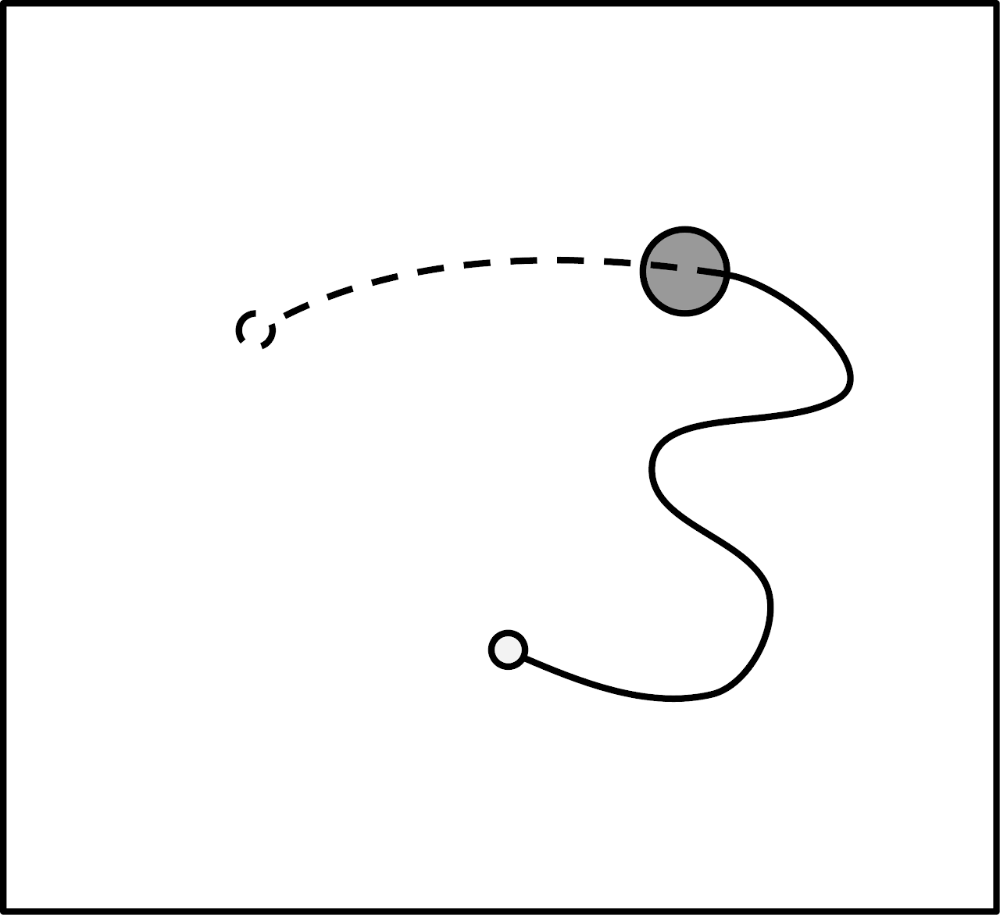

# New paper - No learning where to go without first knowing where you're coming from: Action discovery is trajectory, not endpoint based 

[Back to News](/news)

12 September 2013

We have a new paper out in *Frontier in Cognitive Science*: [No learning where to go without first knowing where you're coming from: Action discovery is trajectory, not endpoint based](http://www.frontiersin.org/cognitive_science/10.3389/fpsyg.2013.00638/abstract). This was work done by Martin and Tom Walton as part of the [IM-CLeVeR](http://www.im-clever.eu/) project.

The research uses our [joystick task](http://www.plosone.org/article/info%3Adoi%2F10.1371%2Fjournal.pone.0037749) (Stafford et al., 2013) to look at how people learn a novel arbitrary action - in this case, moving the joystick to a particular position. By comparing a condition (A) where the start point of the movement is always the same with a condition (B) where the start point moves around, we are able to look at the way people find it easiest to learn novel actions.

In condition (A) you could learn the correct action by identifying the target location or you could learn the correct action by identifying a target trajectory to make (which, since you always start from the same place, would work just as well to get you to the target location). In condition (B) you can't rely on this second strategy, you have to identify the target location and head towards it from wherever you start.

Surprisingly, participants in our experiment were very bad at this second condition - so much so that over the number of trials we gave them, they didn't appear to learn anything about the target location and so acquired no novel action. This suggests that we have strong bias to rely on trajectories of movement when acquiring novel actions, rather code them by arbitrary spatial end points.

The paper: Thirkettle, M., Walton, T., Redgrave, P., Gurney, K., and Stafford, T. (2013). [No learning where to go without first knowing where you're coming from: Action discovery is trajectory, not endpoint based](http://www.frontiersin.org/cognitive_science/10.3389/fpsyg.2013.00638/abstract). *Frontiers in Cognitive Science*, 4, 638. doi:10.3389/fpsyg.2013.00638

The paper is published as part of our Special Topic in Frontiers on [Intrinsic motivations and open-ended development in animals, humans, and robots](http://www.frontiersin.org/Cognitive_Science/researchtopics/Intrinsic_motivations_and_open/1326).

Cited: Stafford, T., Thirkettle, M., Walton, T., Vautrelle, N., Hetherington, L., Port, M., Gurney, K.N., and Redgrave, P. (2012). [A novel task for the investigation of action acquisition](http://www.plosone.org/article/info%3Adoi%2F10.1371%2Fjournal.pone.0037749), *PLoS One*, 7(6), e37749.
