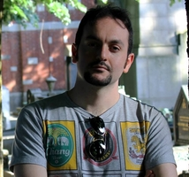

# New PhD Student: Angelo Pirrone 

[Back to News](/news)

27 September 2013

Angelo joins us in the department to run experimental studies of decision making. He is second supervised by [James Marshall](https://www.sheffield.ac.uk/dcs/people/academic/james-marshall) who is a Reader in Computer Science, and head of the [Behavioural and Evolutionary Theory Lab](https://bet-lab.sites.sheffield.ac.uk/).

Angelo's funding comes from the cross-disciplinary neuroeconomics network I lead: [Decision making under uncertainty: Brains, swarms and markets](/news/three-phd-studentships-in-decision-making). We're hoping to use computational, neuroscientific and evolutionary perspectives to guide the development of behavioural studies of perceptual decision making.

More about this, and the neuroeconomics network, soon. In the meantime -- welcome to Sheffield, Angelo!

Update, August 2016: Well, that went quick! Angelo is writing up and looking for postdoctoral positions. [View Angelo's CV](https://scholar.google.co.uk/citations?user=UZzVps4AAAAJ&hl=en&oi=ao)
