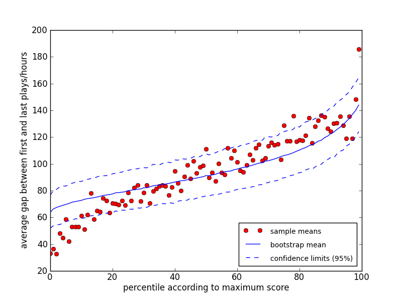

# Tracing the trajectory of skill learning with a very large sample of online game players 

[Back to News](/news)

1 January 2014

I am very excited about this work, just published in [Psychological Science](http://pss.sagepub.com/content/early/2013/12/30/0956797613511466.abstract). Working with a online game developer, I was able to access data from over 850,000 players. This allowed myself and Mike Dewar to look at the learning curve in an unprecedented level of detail. The paper is only a few pages long and there are some great graphs.

Using this real-world learning data set we were able to show that some long-established findings from the literature hold in this domain, as well as confirm [a new finding from this lab](/news/fundamentals-of-learning-the-exploration-exploitation-trade-off) on the value of exploration during learning.

However, rather than the science, in this post I'd like to focus on the methods we used. When I first downloaded the game data I thought I'd be able to use the same approach I was used to using with data sets gathered in the lab - look at the data, maybe in a spreadsheet application like Excel, then run some analyses using a statistics package, such as SPSS.

I was rudely awakened. Firstly, the dataset was so large that my computer couldn't load it all into memory at one time - meaning that you couldn't simply 'look' at the data in Excel. Secondly, the conventional statistical approaches I was used to, and programming techniques, either weren't appropriate or didn't work.

I spent five solid days writing MATLAB code to calculate the practice vs mean performance graph of the data. It took two days to run each time and still didn't give me the level of detail I wanted from the analysis.

Enter, Mike Dewar, dataist and currently employed in the [New York Times R&D Lab](http://nytlabs.com/). Speaking to Mike over Skype, he knocked up a Python script in two minutes which did in 30 seconds what my MATLAB script had taken two days to do. It was obvious I was going to have to learn to code in Python. Mike also persuaded me that the data should be open, so we started a [GitHub repository](https://github.com/tomstafford/axongame) which holds the raw data and all the analysis scripts.

This means that if you want to check any of the results in our paper, or extend them, you can replicate our exact analysis, inspecting the code for errors or interrogating the data for patterns we didn't spot. There are obvious benefits to the scientific community of [this way of working](https://en.wikipedia.org/wiki/Open_science). There are even benefits to us.

When one of the reviewers questioned a cut-off value we had used in the analysis, we were able to write back that the exact value didn't matter, and invited them to check for themselves by downloading our data and code. Even if the reviewer didn't do this, I'm sure our response carried more weight since they knew they could have easily checked our claim if they had wanted. Our full response to the first reviews, as well as a pre-print of the paper is available via the repository also.

Paper: Stafford, T. and Dewar, M. (2014). [Tracing the trajectory of skill learning with a very large sample of online game players](http://pss.sagepub.com/content/early/2013/12/30/0956797613511466.abstract). *Psychological Science.*

Data and analysis code: [github.com/tomstafford/axongame](https://github.com/tomstafford/axongame)

Update - a new publication on this game:

Stafford, T. and Haasnoot, E. (2017). [Testing sleep consolidation in skill learning: A field study using an online game](http://onlinelibrary.wiley.com/wol1/doi/10.1111/tops.12232/abstract). *Topics in Cognitive Science*, 9(2), 485-496. [Data + code](https://osf.io/fckq8/)

