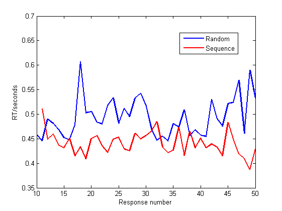

# First visualise, then test 

[Back to News](/news)

12 March 2014

My undergraduate project students are in the final stages of writing up. We've had a lot of meetings over the last few weeks about the correct way to analyse their data. It struck me that there was something I wish I'd emphasised more before they started analysing the data - you should visualise your data first, and only then run your statistical test.

It's all too easy to approach statistical tests as a kind of magic black box which you apply to the data and - cher-ching! - a result comes out (hopefully p\<0.05). We teach our students all about the right kinds of tests, and the technical details of reporting them (F values, p values, degrees of freedom and all that).

These last few weeks it has felt to me that our focus on teaching these details can obscure the big picture - you need to understand your data before you can understand the statistical test. Understanding the data means first you want to see the shape of the distributions and the tendency for any difference between groups.

This means histograms of the individual scores (how are they distributed? Outliers?), scatterplots of variables against each other ([any correlation?](https://en.wikipedia.org/wiki/Anscombe%27s_quartet)) and a simple eye-balling of the means for different experimental conditions (how big is the difference? Is it in the direction you expected?).

Without this preparatory stage where you get an appreciation for the form of the data, you risk running an inappropriate test, or running the appropriate test but not knowing what it means. For example, you get a significant difference between the groups, but you haven't checked first whether it is in the direction predicted or not.

These statistical tests are not a magic black box to meaning, they are props for our intuition. You look at the graph and think that Group A scored higher on average than Group B. Now your t-test tells you something about whether your intuition is reliable, or whether you have been fooling yourself through wishful thinking ([all too easy to do](https://en.wikipedia.org/wiki/Apophenia)).

The technical details of running and reporting statistical tests are important, but they are not as important as making an argument about the patterns in the data. Your tests support this argument - they don't determine it.

Further reading: Abelson, R. P. (1995). *Statistics as principled argument*. Psychology Press.
