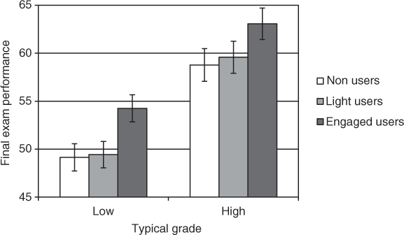

# New paper: Wiki users get higher exam scores 

[Back to News](/news)

7 August 2014

Just out in Research in Learning Technology, is our paper [Students' engagement with a collaborative wiki tool predicts enhanced written exam performance](http://www.researchinlearningtechnology.net/index.php/rlt/article/view/22797). This is an observational study which tries to answer the question of how students on my undergraduate cognitive psychology course can improve their grades.

One of the great misconceptions about studying is that you just need to learn the material. Courses and exams which encourage regurgitation don't help. In fact, as well as memorising content, you also need to understand it and reflect that understanding in writing. That is what the exam tests, and what an undergraduate education should test, in my opinion).

A few years ago I realised, marking exams, that many students weren't fulfilling their potential to understand and explain, and were relying too much on simply recalling the lecture and textbook content.

To address this, I got rid of the textbook for my course and introduced a wiki - an editable set of webpages. By using the wiki, students would write their own textbook. An inspiration for this was a quote from [Francis Bacon](http://idiolect.org.uk/notes/?p=50):

"Reading maketh a full man,\
conference a ready man,\
and writing an exact man."

The reviewers asked that I remove this quote from the paper, so it has to go here!

Each year I cleared the wiki and encouraged the people who took the course to read, write and edit using the wiki. I also kept a record of who edited the wiki, and their final exam scores.

The paper uses this data to show that people who made more edits to the wiki scored more highly on the exam. The obvious confound is that people who score more highly on exams will also be the ones who edit the wiki more. We tried to account for this statistically by including students' scores on their other psychology exams in our analysis. This has the effect - we argue - of removing the general effect of students' propensity to enjoy psychology and study hard and isolate the additional effect of using the wiki on my particular course.

The result, pleasingly, is that students who used the wiki more scored better on the final exam, even accounting for their general tendency to score well on exams (as measured by grades for other courses). This means that even among people who generally do badly in exams, and did badly on my exam, those who used the wiki more did better. This is evidence that the wiki is beneficial for everyone, not just people who are good at exams and/or highly motivated to study.

Here's the graph, Figure 1 from our paper:

This is a large effect - the benefit is around five percentage points, easily enough to lift you from a mid 2:2 to a 2:1, or a mid 2:1 to a First.

Fans of wiki research should check out this recent paper, [Wikipedia classroom experiment: Bidirectional benefits of students' engagement in online production communities](http://kraut.hciresearch.org/sites/kraut.hciresearch.org/files/open/Farzan12-SocializingVolunteersInAnOnlineCommunity-cr.pdf), which explores potential wider benefits of using wiki editing in the classroom. Our paper is unique for focussing on the bottom line of final course grades, and for trying to address the confound that students who work harder at psychology are likely to both get higher exam scores and use the wiki more.

The true test of the benefit of the wiki would be an experimental intervention where one group of students used a wiki and another did something else. [Read this paper](http://www.researchinlearningtechnology.net/index.php/rlt/article/view/22797) for a discussion of this and why we believe editing a wiki is so useful for learning.

Thanks go to my collaborators. Harriet reviewed the literature, Herman installed the wiki for me and did the analysis. Together we discussed the research and wrote the paper.

Full citation:

Stafford, T., Elgueta, H., and Cameron, H. (2014). [Students' engagement with a collaborative wiki tool predicts enhanced written exam performance](http://www.researchinlearningtechnology.net/index.php/rlt/article/view/22797). *Research in Learning Technology*, 22, 22797. doi:10.3402/rlt.v22.22797
