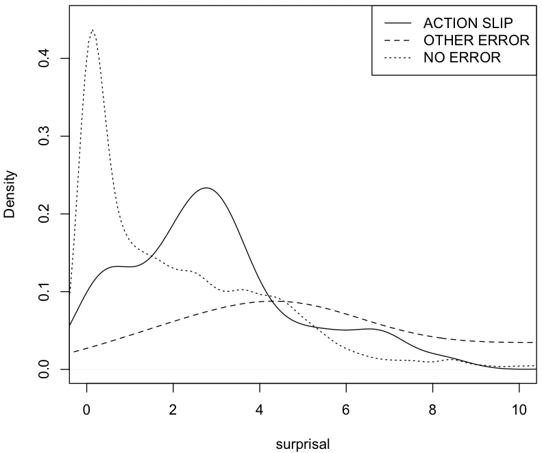

# New grant - Reduced habitual intrusions: An early marker for Parkinson's Disease? 

[Back to News](/news)

30 September 2014

I have very pleased to announce that the Michael J Fox Foundation have funded a project I lead titled [Reduced habitual intrusions: An early marker for Parkinson's Disease?](https://www.michaeljfox.org/foundation/grant-detail.php?grant_id=1369) The project is for one year, and is a collaboration between a psychologist (myself), a neuroscientist (Pete Redgrave), a clinician specialising in Parkinson's (Jose Obeso, in Spain) and a computational linguist (Colin Bannard, in Liverpool). Mariana Leriche will be joining us as a postdoc.

The idea of the project stems from hypothesis that Parkinson's Disease will be specifically characterised by a loss of habitual control in the motor system. This was proposed by [Pete, Jose and others in 2010](http://www.nature.com/nrn/journal/v11/n11/abs/nrn2915.html).

Since my PhD I've been interested automatic processes in behaviour. One phenomenon which seems to offer particular promise for exploring the interaction between habits and deliberate control is the 'action slip'. This is an error where a habit intrudes into the normal stream of intentional action - for example, such as when you put the cereal in to the fridge, or when someone greets you by asking "Isn't it a nice day?" and you say "I'm fine thank you".

An interesting prediction of the Redgrave et al. theory is people with Parkinson's should make fewer action slips, in contrast to all other types of movement errors, which you would expect to increase as the disease progresses.

The domain we're going to look at this in is typing, which I've worked with before, and which - I've argued - is a great domain for looking at how skill, intention and habit combine in an everyday task which generates lots of easily coded data.

I feel the project reflects exactly the kind of work I aspire to do - cognitive science which uses precise behavioural measurement, informed by both neuroscientific and computational perspectives, and in the service of am ambitious but valuable goal. Now, of course, we actually have to get on and do it.

Update 2019: Our paper from this project now published. Bannard, C., Leriche, M., Bandmann, O., Brown, C. H., Ferracane, E., Sánchez-Ferro, A., ... and Stafford, T. (2019). [Reduced habit-driven errors in Parkinson's Disease](https://www.nature.com/articles/s41598-019-39294-z/tables/). *Scientific Reports*, 9(1), 3423.

