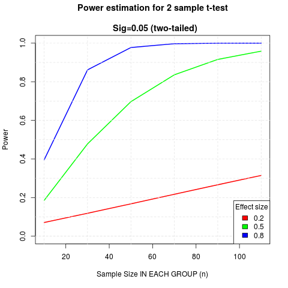

# Power analysis for a between-sample experiment 

[Back to News](/news)

19 June 2015

Understanding statistical power is essential if you want to avoid wasting your time in psychology. The power of an experiment is its sensitivity - the likelihood that, if the effect tested for is real, your experiment will be able to detect it.

Statistical power is determined by the type of statistical test you are doing, the number of people you test and the effect size. The effect size is, in turn, determined by the reliability of the thing you are measuring, and how much it is pushed around by whatever you are manipulating.

Since it is a common test, I've been doing a power analysis for a two-sample (two-sided) t-test, for small, medium and large effects (as conventionally defined). The results should worry you.

This graph shows you how many people you need in each group for your test to have 80% power - a standard desirable level of power - meaning that if your effect is real you've an 80% chance of detecting it.

Things to note:

-   Even for a large (0.8) effect you need close to 30 people (total n = 60) to have 80% power.

-   For a medium effect (0.5) this is more like 70 people (total n = 140).

-   The required sample size increases dramatically as effect size drops.

-   For small effects, the sample required for 80% is around 400 in each group (total n = 800).

What this means is that if you don't have a large effect, studies with between groups analysis and an n of less than 60 aren't worth running. Even if you are studying a real phenomenon you aren't using a statistical lens with enough sensitivity to be able to tell. You'll get to the end and won't know if the phenomenon you are looking for isn't real or if you just got unlucky with who you tested.

Implications for anyone planning an experiment:

-   Is your effect very strong? If so, you may rely on a smaller sample. For illustrative purposes the [effect size of male-female height difference is \~1.7](http://figshare.com/articles/Illustrative_effect_sizes_for_sex_differences/866802), so large enough to detect with a small sample. But if your effect is this obvious, why do you need an experiment?

-   You really should prefer within-sample analysis, whenever possible (power analysis of this left as an exercise).

-   You can get away with smaller samples if you make your measure more reliable, or if you make your manipulation more impactful. Both of these will increase your effect size, the first by narrowing the variance within each group, the second by increasing the distance between them.

Technical notes:

-   I did this cribbing code from Rob Kabacoff's [helpful page on power analysis](http://www.statmethods.net/stats/power.html).

-   [Code for the graph shown above (R, 3KB)](https://drive.google.com/file/d/1zckg7vf4_P6U1A-IsEZ5xNwV_mtRy6ke/view?usp=sharing)

-   I use and recommend [Rstudio](http://www.rstudio.com/).
