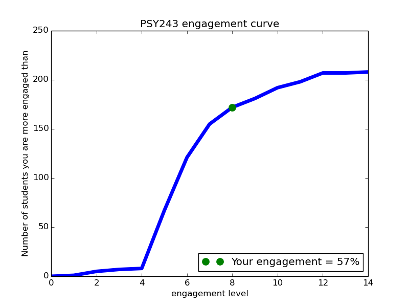

# Individualised student feedback 

[Back to News](/news)

15 December 2015

My Cognitive Psychology course is structured around activities which occur before and after the lectures, many of them online. This year I wrote a Python script which emailed each student an analysis and personalised graph of their engagement with the course. Here's what it looked like:

---------- Forwarded message ----------

From: me

Date: 4 December 2015 at 10:53

Subject: engagement with PSY243

To: student@sheffield.ac.uk

This is an automatically generated email, containing feedback on your engagement with PSY243 course activities. Nobody but you (not even me) has seen these results, and they DO NOT AFFECT OR REFLECT your grade for this course. They have been prepared merely as feedback on how you have engaged with activities as part of PSY243.

Here is a record of your activities:

Weeks 1-9, concept checking quizzes completed (out of 7): 4

Week 1-10, asked question via wiki or discussion group: NO

Week 3, submitted practice answer: NO

Week 7, submitted answer for peer review (compulsory): YES

Week 8, number of peer reviews submitted (out of 3, compulsory): 3

Week 10, attended seminar discussion: NO

We can combine these records to create a MODULE ACTIVITY ENGAGEMENT SCORE.

\* \* \* Your score is 57% \* \* \*

This puts you in the TOP half of the course. Obviously this score does not include activities for which I do not have records. This includes things like lecture attendance, asking questions in lectures, private study, etc.

If we plot the engagement scores for the whole year against the number of people who get that engagement score or lower we get a graph showing the spread of engagement across the course. This graph, and your position on it, are attached to this email. People who have done the least will be towards the left, people who have done the most will appear towards the right of the curve. You can see that there is a spread of engagement scores. Very few people have not done anything, very few have done everything.

I hope you find this feedback useful. PSY243 is designed as a course where the activities structure your private study, rather than as a course where a fixed set of knowledge is conveyed in lectures. This is why I put such emphasis on these extra activities, and provide feedback on your engagement with them. Next week you have the chance to give feedback on PSY243 as part of the course evaluation, so please do say if you can think how the course might be improved

Yours,

Tom, PSY243 MO

I designed this course to be structured around a single editable webpage, a wiki, which would provide all the information needed to understand the course from day one.

My ambition was to use the lectures to focus on two things you can't get from a textbook. The first being live exposure to a specialist explaining how they approach a problem or topic in their area. The second being an opportunity to discuss the material - a so called '[flipped classroom](https://medium.com/@tomstafford/cheap-tricks-for-starting-discussions-in-lectures-c6baecd4a6c8)'.

This year I added pre-lecture quizzes to the range of activities available on the course. These were designed so students could test their understanding of the foundational material upon which each lecture drew, and are part of this wider plan to provide clear structure for student's engagement with the course around the lectures.

If you're the sort of person who wants to see the code, [download it here (PY, 9KB)](https://drive.google.com/file/d/1ZovZEF6mGxeP2gB1NHQ2Cj8joL3HcPmq/view?usp=sharing). At your own risk.
