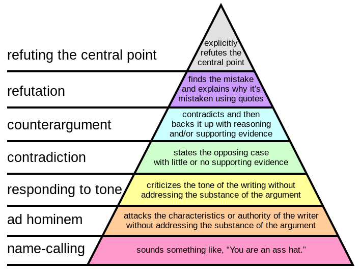
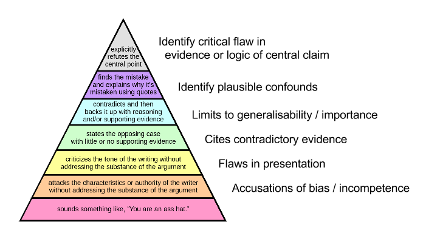

# A hierarchy of critique 

[Back to News](/news)

7 June 2016

Paul Graham has a [hierarchy of disagreement](http://paulgraham.com/disagree.html). He's obviously spent his fair share of time watching debates unfold on internet forums, and has categorised the quality of points people make.

At the bottom are distraction and name calling. To get to the top you need to identify and refute the central point. Obviously we should aim to produce disagreements from the top of the hierarchy if we want to have a productive debate.

The hierarchy has been expressed in this handy graphic:

Hierarchy of disagreement graphic in text-form

-   **Refuting the central point:** Refutes the central point. (Top level)

-   **Refutation:** Finds the mistake and explains why it\'s mistaken using quotes.

-   **Counterargument:** Contradicts and then backs it up with reasoning and/or supporting evidence.

-   **Contradiction:** States the opposing case with little or no supporting evidence.

-   **Responding to tone:** Criticises the tone of the writing without addressing the substance of the argument.

-   **Ad hominem:** Attacks the characteristics or authority of the writer without addressing the substance of the argument.

-   **Name-calling:** Sounds something like, "You are an ass hat." (Bottom level)

I think some students would find it useful to have a 'hierarchy of critique' to identify the most valuable points to make in an essay. I've written before about [how to criticise a psychology study](/news/teaching-what-it-means-to-be-critical). The essential idea is the same as Graham's: not all criticisms are equal - there are more and less interesting flaws in a study which you can point out.

In brief, like the top levels of Graham's hierarchy, the best criticisms of a study engage with the propositions that the study authors are trying to establish. Every study will have flaws, but the critical flaws are the ones which break the links between what the experiment shows and what the author's are trying to claim based on it.

So, without further ado, here is my hierarchy of critique graphic:

Hierarchy of critique graphic in text-form

-   **Identify critical flaw in evidence or logic of central claim:** Refutes the central point. (Top level)

-   **Identify plausible confounds:** Finds the mistake and explains why it\'s mistaken using quotes.

-   **Limits to generalisability/importance:** Contradicts and then backs it up with reasoning and/or supporting evidence.

-   **Cites contradictory evidence:** States the opposing case with little or no supporting evidence.

-   **Flaws in presentation:** Criticises the tone of the writing without addressing the substance of the argument.

-   **Accusations of bias/incompetence:** Attacks the characteristics or authority of the writer without addressing the substance of the argument.

-   Sounds something like, "You are an ass hat." (Bottom level)

The exact contents aren't as important as the fact that there is a hierarchy, and we should always be asking ourselves how high up the hierarchy the point we're trying to make is. If it is near the bottom, maybe there are better criticisms to spent time and words on.

For more on this, read [What it means to be critical of a psychology study](/news/teaching-what-it-means-to-be-critical) or [watch this video](https://www.youtube.com/watch?v=wjOfDc-JsZc) I made saying the same thing.
