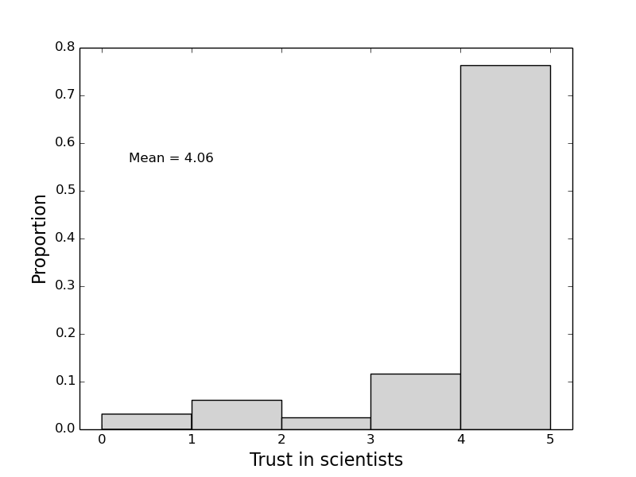
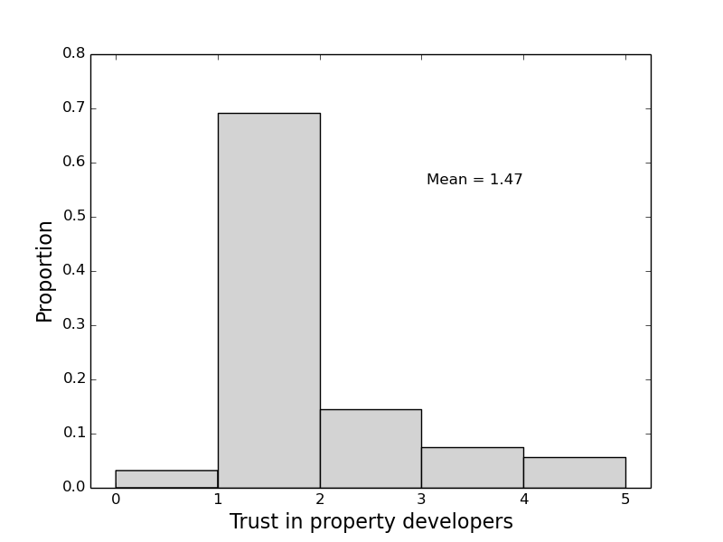
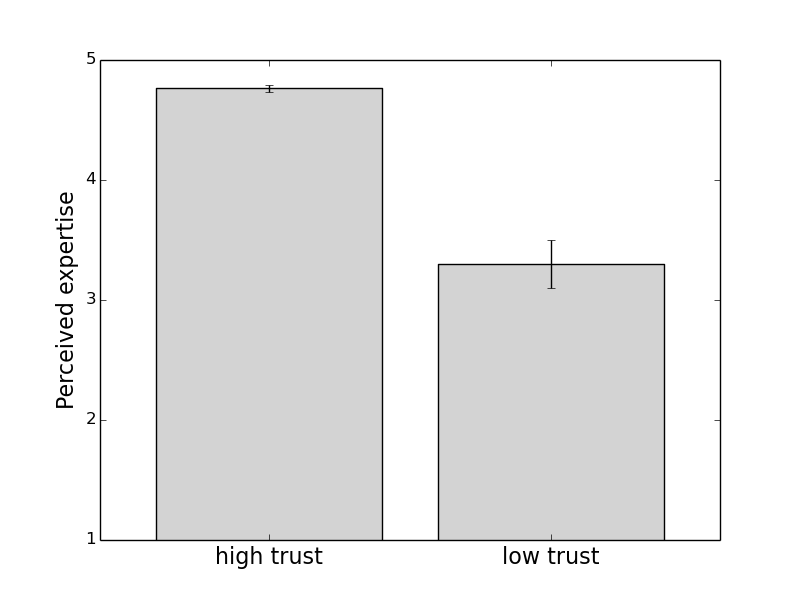
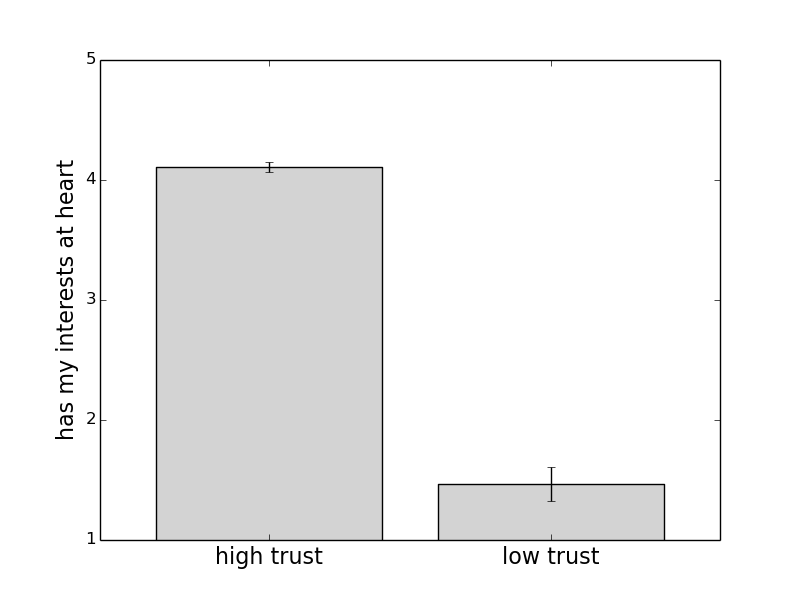
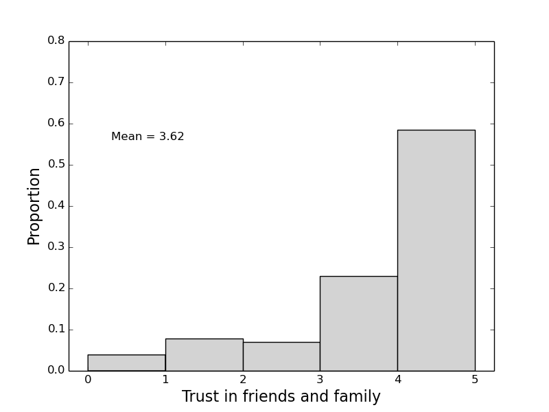

# Why don't we trust the experts? 

[Back to News](/news)

4 July 2016

During the EU referendum debate a friend of mine, who happens to be a professor of European law, asked in exasperation why so much of the country seems unwilling to trust experts on the EU.

When we want a haircut, we trust the hairdresser. If we want a car fixed, we trust the mechanic. Now, when we need informed comment on EU, why don't we trust people who have spent a lifetime studying the topic?

The question rattled around in my mind, until I realised I had actually done some research which provides part of the answer. During my postdoc with Dick Eiser we did a survey of people who lived on land which may have been contaminated with industrial pollutants. We asked people with houses on two such 'brownfield' sites, one in the urban north, and one in the urban south, who they trusted to tell them about the possible risks.

One group we asked about the perception of was scientists. The householders answered on a scale which went from 1 to 5 (5 is the most trust). Here's the distribution of answers:

As you can see, scientists are highly trusted. Compare with the ratings of property developers:

We also asked our respondents about how they rated different communicators on various dimensions. One dimension was expertise about this topic. As you'd expect, scientists were rated as highly expert in the risks of possible brownfield pollution.

We also asked people about whether they believed the different potential communicators of risks has their interests at heart, and whether they would be open with their beliefs about risks. With this information, it is possible, statistically, to analyse not just who is trusted, but why they are trusted.

The results, [published in Eiser et al. (2009) (PDF, 260KB)](https://drive.google.com/file/d/1LrYshGTdYcubTeQ91GrcSWeO-uQFE3xW/view?usp=sharing), show that expertise is not the strongest determinate of who is trusted. Instead, people trust those who they believe have their best interests at heart. This is three to four times more important than perception of expertise (fig. 3 on p. 294 for those reading along with the paper in hand).

One way of making this clear is to pick out the people who have high trust in scientists (rating of 4 or 5), and compare them to people who have low trust (rating scientists a 1 or 2 for trust). The perceptions of their expertise differ, but not too much:

Even those who don't trust scientists recognise that they know about pollution risks. In other words, their actual expertise isn't in question.

The difference is seen whether scientists are seen to have the householders' interests at heart:

So those who didn't trust the scientist tend to believe that the scientists don't care about them.

The difference is made clear by one group that was highly trusted to communicate risks of brownfield land - friends and family:

Again, the same relationship between variables held. Trust in friends and family was driven more by a perception of shared interests than it was by perceptions of expertise. Remember, this isn't a measure of generalised trust, but specifically of trust in their communications about pollution risks.

Maybe your friends and family aren't experts in pollution risks, but they surely have your best interests at heart, and that is why they are nearly as trusted on this topic as scientists, despite their lack of expertise.

So here we have a partial answer to why experts aren't trusted. They aren't trusted by people who feel alienated from them. My reading of this study would be that it isn't that we live in a 'post-fact' political climate. Rather it is that attempts to take facts out of their social context won't work.

For me and my friends it seems incomprehensible to ignore the facts, whether about the [science of vaccination](https://theconversation.com/throwing-science-at-anti-vaxxers-just-makes-them-more-hardline-37721), or the law and economics of leaving the EU. But me and my friends do very well from the status quo - the Treasury, the Bar, the University work well for us. We know who these people are, we know how they work, and we trust them because we feel they are working for us, in some wider sense.

People who voted Leave do suffer from a lack of trust, and my best guess is that this is a reflection of a belief that most authorities aren't on their side, not because they necessarily reject their status as experts.

The paper is written up as: Eiser, J. R., Stafford, T., Henneberry, J., and Catney, P. (2009). Trust me, I'm a scientist (not a developer): Perceived expertise and motives as predictors of trust in assessment of risk from contaminated land. Risk Analysis, 29(2), 288-297. <https://doi.org/10.1111/j.1539-6924.2008.01131.x>\
[View paper (PDF, 260KB)](https://drive.google.com/file/d/1LrYshGTdYcubTeQ91GrcSWeO-uQFE3xW/view?usp=sharing)

[Data and analysis for this post (ZIP, 545KB)](https://drive.google.com/file/d/1jujtJLua4sdA1NRLK1x9gj4WHyfhJ23D/view?usp=sharing)
