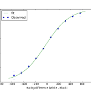

# Cognitive Science Conference, Philadelphia 

[Back to News](/news)

8 August 2016

This week, 10-13 August, I am at the Annual Cognitive Science Society Conference in Philadelphia. While there I am presenting work which uses a large data set on chess players and their games.

Previously the phenomenon of 'stereotype threat' has been found in many domains where people's performance suffers when they are made more aware of their identity as a member of a social group which is expected to perform poorly. For example there is a stereotype that men are better at maths, and stereotype threat has been reported for female students taking maths exams when their identity as a women is emphasised, even if only subtly, by asking them to declare their gender on the top of the exam paper, for example.

This effect has been reported for chess, which is heavily male dominated, especially among top players. However, the reports of stereotype threat in chess, like in many other domains, often rely on laboratory experiments with a small number of people, around or less than 100.

My data are more than 11 million games of chess: every tournament recorded with FIDE, the international chess authority, between 2008-2015. Using this data, I asked if it was possible to observe stereotype threat in this real world setting. If the phenomenon is real, however small it is, I should be able to observe it playing out in this data - the sheer number of games I can analyse allows me a very powerful statistical lens.

The answer is, no: there is no stereotype threat in international chess. To see how I determined this, and what I think it means, [read the paper (PDF, 327KB)](https://mindmodeling.org/cogsci2016/papers/0078/paper0078.pdf), or see the [Jupyter notebook which walks you through the key analysis](https://github.com/tomstafford/FIDEchess/blob/master/no_ST_in_chess.ipynb). If you're at the conference, come and visit the poster - [PDF (3.8MB)](https://drive.google.com/file/d/1wE_RmmtY6Mkaba5IRaQLiZcYdowwri57/view?usp=sharing), [PNG image (614KB)](https://drive.google.com/file/d/1CB8T3TokX7HxquSvTLyRQRP0XWrLv5DZ/view?usp=sharing).

Jeff Sonas, who compiled the data, has been kind enough to allow me to make available a 10% sample of the data (still over one million games), and this, along with all the analysis code for the paper, is [available via the Open Science Framework](https://osf.io/aeksv/).

There's lots more to come from this data - as well as analysing performance related effects, the data affords a fantastic opportunity to look at learning curves and try to figure out what affects how players' performance changes over time.
