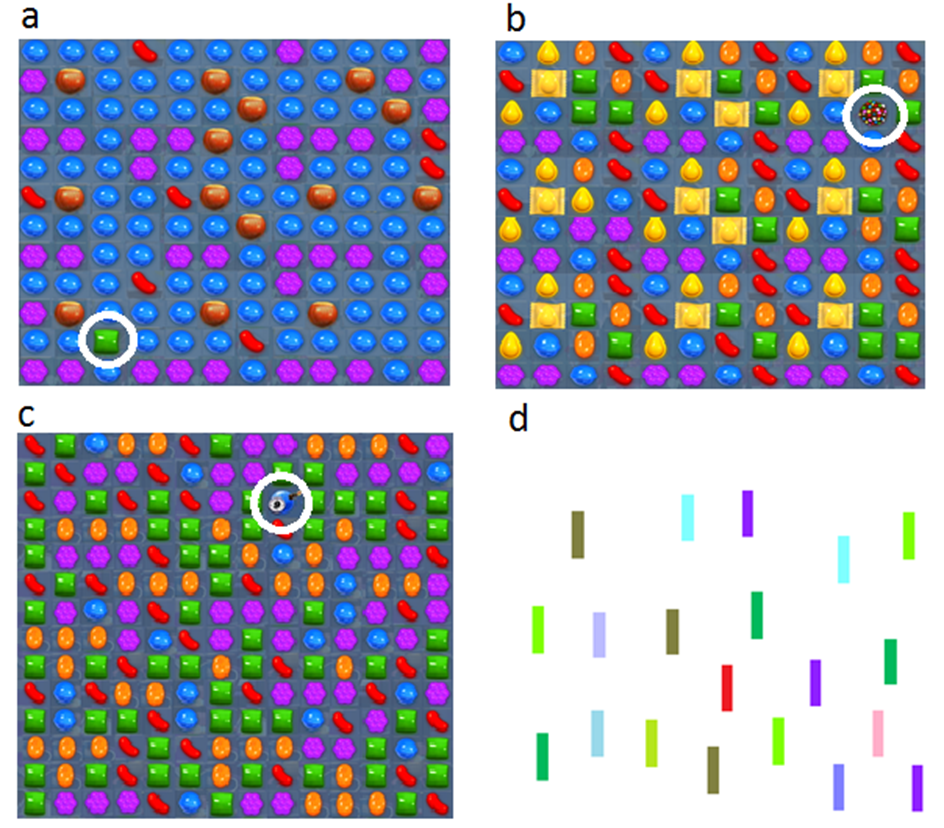
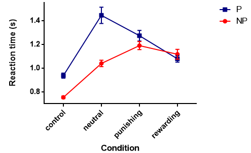
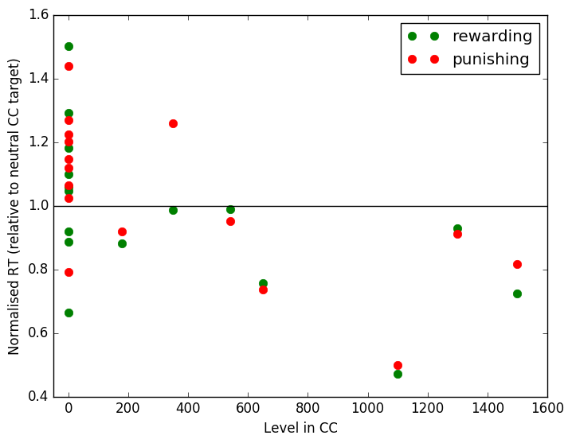

# Using Candy Crush to study perceptual learning 

[Back to News](/news)

21 October 2016

This is a guest post by Gabriela Raleva, who did a summer project with me in between her first and second years of the undergraduate degree.

Visual learning refers to the enhanced sensitivity to visually relevant stimuli. Affective value of stimuli, eg reward, punishment, has been proposed to enhance action selection via instrumental learning (Hickey et al., 2010, Wilbertz et al., 2014).

The majority of studies in perceptual learning adopt an artificial approach of training participants in the lab for many sessions before testing them (although, see Bavelier et al., 2012).

## Candy Crush project 

We used Candy Crush game sets as it represents an ideal platform for natural visual learning and assessed the performance of experienced players that have willingly engaged in a lot of practice hours as well as non-players.

In a between-subject design participants completed a visual search task, searching for a uniquely-shaped Candy Crush target among a number of nonhomogeneous Candy Crush distractors. Targets were divided into four conditions (Figure 1):

1.  Neutral value

2.  Reward value

3.  Punishment value

4.  Control condition

Reaction time for detection of targets was assessed and compared for each condition.

Figure 1. Target-present sets in all four conditions:

-   \(a\) Neutral condition showing a single green candy (circled) which is a target of neutral consequences in the game.

-   \(b\) Reward-associated containing a single multi-coloured bomb candy (circled) which is of positive consequences in the game.

-   \(c\) Punishment-associated condition containing a blue bomb (circled) of negative consequences in the game.

-   \(d\) Control condition.

## Results 

The results suggest that players and non-players revealed largely comparable responses in their detection of control, neutral, negative and positive stimuli (Figure 2). This indicates that the results are not due to self-selection bias.

However, players were 35% faster at detecting rewarding targets than neutral targets stimuli. In contrast, non-players were on average 5% slower in detecting rewarding compared to neutral targets.

Our analyses indicate that players reveal a consistent pattern of greater rewarding/neutral reaction time ratios than those of non-players consistent with the idea that features of affective-associated stimuli facilitate their perception in visual processing.

Furthermore, the only Candy Crush condition in which players showed significantly slower reaction times than non-players is the neutral condition. One possible explanation is that players have developed better visual templates in regards to the game (Bejjanki et al., 2014) and therefore exhibit a visually holistic mode of performance (Green and Bavelier, 2003).

Players may have learnt to quickly recognise patterns beneficial for the game such as the rewarding bomb. The green neutral candies compose a beneficial pattern only when they can be combined (at least three) so it is possible that players learnt to recognise a single neutral candy as a distractor and thus suppress it more effectively.

Such holistic expert performance is characterised by 'chunking' - a process during which individual constituents are processed as a single perceptual or cognitive entity.

Figure 2. Mean reaction time of players and non-players in all four conditions as obtained by the target detection task.

## References 

Bavelier, D., Green, C. S., Pouget, A., and Schrater, P. (2012). Brain plasticity through the life span: Learning to learn and action video games. Annual Reviews of Neuroscience, 35, 391--416.

Bejjanki, V. R., Zhang, R., Li, R., Pouget, A., Green, C. S., Lu, Z.-L., and Bavelier, D. (2014). Action video game play facilitates the development of better perceptual templates. Proceedings of the National Academy of Sciences, 111(47), 16961-6.

Green, C. S., and Bavelier, D. (2003). Action video game modifies visual selective attention. Nature, 423(6939), 534-537.

Hickey, C., Chelazzi, L., and Theeuwes, J. (2010). Reward guides vision when it's your thing: Trait reward-seeking in reward-mediated visual priming. PLoS ONE, 5(11), 1-5.

Wilbertz, G., Van Slooten, J., and Sterzer, P. (2014). Reinforcement of perceptual inference: Reward and punishment alter conscious visual perception during binocular rivalry. Frontiers in Psychology, 5, 1-9.

## Postscript from Tom 

One of the great difficulties of studying learning is that true expertise only comes after many many hours of practice. Psychologists often study perceptual learning in the lab with participants engaging in training with specific stimuli that last a few hours.

The results of this project demonstrate the potential for using people who have already given themselves hundreds of hours of training with the specific stimuli as a side effect of a game they've played.

To illustrate how large the effect is, in the graph below I plotted each participant's Candy Crush level, so 0 for non-players, against the ratio rewarding/punishing stimulus RT : neutral stimulus RT. Even with the small number of participants the effect is clear - Candy Crush players are faster for the value-relevant stimuli relative to neutral stimuli, non-players aren't.

The black line shows where participants' reaction times should be if they are equally fast on the valuable Candy Crush stimuli as with neutral Candy Crush stimuli.

