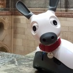

# Cyberselves: How immersive technologies will impact our future selves 

[Back to News](/news)

14 December 2017

We're happy to announce the re-launch of our project 'Cyberselves: How immersive technologies will impact our future selves'. Straight out of [Sheffield Robotics](http://www.sheffieldrobotics.ac.uk/), the project aims to explore the effects of technology like robot avatars, virtual reality, AI servants and other tech which alters your perception or ability to act. We're interested in work, play and how our sense of ourselves and our bodies is going to change as this technology becomes more widespread.

We're [funded by the AHRC](http://gtr.rcuk.ac.uk/projects?ref=AH%2FR004811%2F1) to run workshops and bring our [roadshow](https://cyberselves.org/roadshow/more-information/) of hands-on cyber-experiences to places across the UK in the coming year.

From the [Cyberselves website](https://cyberselves.org/):

Cyberselves will examine the transforming impact of immersive technologies on our societies and cultures. Our project will bring an immersive, entertaining experience to people in unconventional locations, a Cyberselves Roadshow, that will give participants the chance to transport themselves into the body of a humanoid robot, and to experience the world from that mechanical body.

Visitors to the roadshow will also get a chance to have hands-on experiences with other social robots, coding and virtual/augmented reality demonstrations, while chatting to Sheffield Robotics' knowledgeable researchers.

The project is a follow-up to our earlier AHRC project, '[Cyberselves in Immersive Technologies](http://gtr.rcuk.ac.uk/projects?ref=AH%2FM002950%2F1)', which brought together robotics engineers, philosophers, psychologists, scholars of literature, and neuroscientists.

We're running a [workshop on the effects of teleoperation and telepresence](https://cyberselves.org/our-workshops/cyberselves-workshop-on-teleoperation-and-telepresence/), in Oxford in February.

Call for papers: [Symposium on AI, robots and public engagement](https://cyberselves.org/2017/12/06/call-for-papers-symposium-on-ai-robots-and-public-engagement-at-2018-aisb-convention/) at 2018 AISB Convention (April 2018).

Project updates on Twitter, via [Dreaming Robots](https://twitter.com/DreamingRobots), 'Looking at robots in the news, films, literature and the popular imagination'.

Cross-posted at [mindhacks.com](https://mindhacks.com/2017/12/14/cyberselves-how-%E2%80%A6ur-future-selves/)
