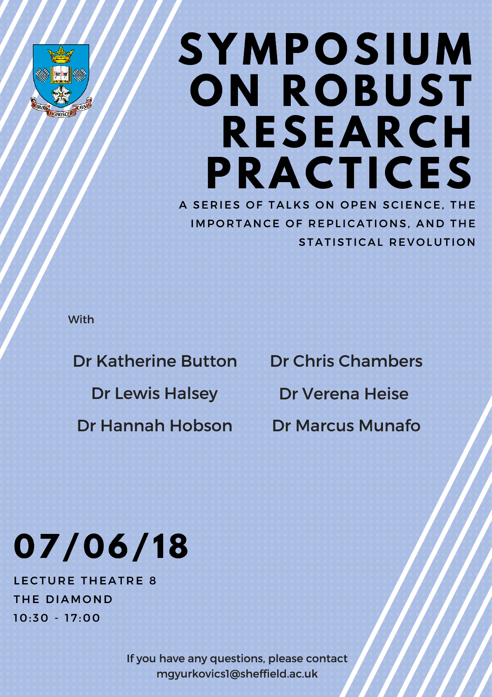

# Symposium on Robust Research Practices 

[Back to News](/news)

30 April 2018

[Mate Gyurkovics](https://scholar.google.com/citations?user=XGk9OnEAAAAJ&hl=hu&oi=ao) has organised a Symposium on Robust Research Practices at the University of Sheffied on 7 June 2018. There is a fantastic speaker line up with a series of talks on open science, the importance of replications and the statistical revolution.

Topics will include open science as a measure to include quality control; the advantages of registered reports and pre-prints, and statistical issues (eg concerning the p-value) and potential alternatives.

Speakers:

-   Dr Marcus Munafo (Bristol)

-   Dr Chris Chambers (Cardiff)

-   Dr Kate Button (Bath)

-   Dr Hannah Hobson (Greenwich)

-   Dr Verena Heise (Oxford)

-   Dr Lewis Halsey (Roehampton)

Date: Thursday 7 June 2018

Time: 10.30am to 5.00pm

Venue: [The Diamond](https://www.sheffield.ac.uk/diamond), Lecture Theatre 8, the University of Sheffield

If you have any questions, contact [mgyurkovics1@sheffield.ac.uk](mailto:mgyurkovics1@sheffield.ac.uk).

## Update 

View the [Robust research symposium slides and talks](/sub-sites/robust-research).
