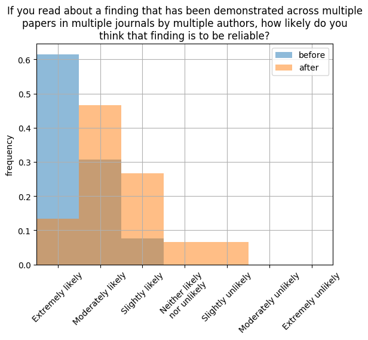
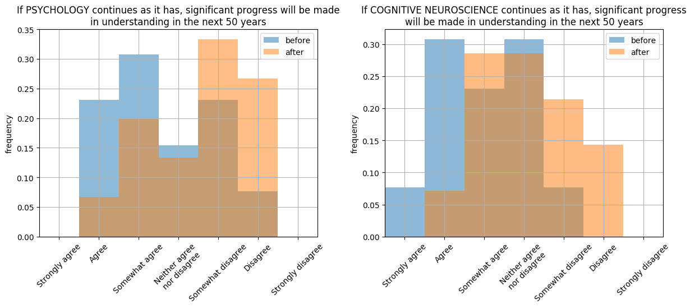

# Teaching: How reliable is cognitive neuroscience? 

[Back to News](/news)

16 June 2018

This spring I taught my MSc module 'PSY6316 Current Issues in Cognitive Neuroscience' on the topic 'How reliable is cognitive neuroscience?'.

Module outline:

What has been called The Replication Crisis has sparked widespread introspection about the standards and protocols of science, particularly within the behavioural sciences.

This course, though reading a series of landmark papers and class discussion, will consider to extent to which doubts about the reliability of empirical work affect cognitive neuroscience.

Can we trust the published papers in this field? Are the effects which we investigate reliable? If not, how can work in cognitive neuroscience be made more trustworthy?

The basic idea was to read material on robust science and scandals of unreliability in psychology, and ask the students to consider the extent these applied to cognitive neuroscience.

I asked students before they took the course, and after, a set of questions by anonymous questionnaire. The responses indicate that the course did at least induce some scepticism in the students.

The graph below shows their before-vs-after responses to the statement: 'If you read about a finding that has been demonstrated across multiple papers in multiple journals by multiple authors, how likely do you think that finding is to be reliable?'

The graphs below show the responses for:

-   'If PSYCHOLOGY continues as it has, significant progress will be made in understanding in the next 50 years'.

-   'If COGNITIVE NEUROSCIENCE continues as it has, significant progress will be made in understanding in the next 50 years'.

Note that optimism is reduced for both fields, but started higher for cognitive neuroscience, perhaps unsurprising since many of the students are on the cogneuro MSc.

The full list of questions I asked, the responses and the plots are available in [this folder (ZIP, 595KB)](https://drive.google.com/file/d/1zkqVawb6HrUkZWxNzx56V9N8PgBmI-25/view?usp=sharing). Most importantly maybe, the reading list is also available in the folder, which contains landmark papers on replicability/reproducibility in psychology, as well as relevant readings concerning reliability in neuroimaging.

I have always run this course as a discussion class rather than lecture class, and I have always based it around controversies in cognitive neuroscience. Last year it was '[Sex differences in the brain](/sub-sites/delusions-of-gender)'. You can read more about the thinking behind the course in:

Stafford, T. (2008) [A fire to be lighted: A case-study in enquiry based learning](http://community.dur.ac.uk/pestlhe.learning/index.php/pestlhe/article/view/128/148). Practice and Evidence of the Scholarship of Teaching and Learning in Higher Education, 3(1), 20-42.

Related: materials from the [Open Science and Robust Research Practices](/sub-sites/robust-research) symposium held in Sheffield on 7 June 2018.
