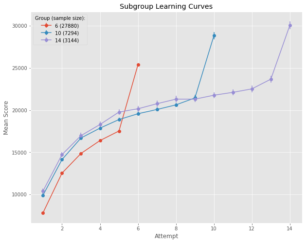

# Quit while you're ahead: A surprising interaction between game performance and motivation 

[Back to News](/news)

20 June 2018

Over the last nine months I've been lucky enough to work with Dagmar Adamcová, who has been at the University of Sheffield on an Erasmus scheme internship during her MSc studies at Masaryk University in the Czech Republic.

Dagmar's project focused on investigating an oddity in player behaviour from a simple online game I have data for: in this game the players tended to quit on a high score. The game is [Axon](http://axon.wellcomeapps.com/), which I've [published papers](/news/tracing-the-trajectory-of-skill-learning-with-a-very-large-sample) on previously, showing patterns in how people get better at the game with practice.

Normally I average over players who play different numbers of games, and in the average of performance against play attempt we see the typical learning curve - people get better quickly at first, then the rate of increase slows down.

The odd pattern of behaviour which Dagmar looked at can be seen clearly if we divide players into subgroups who play exactly the same number of times, and plot their average performance:

Subgroup learning curves - graph from [Dagmar's report](https://github.com/dagmaradamcova/axon-drop-out/blob/master/axon_drop_out.ipynb).

As you can see, this isn't a typical smooth learning curve. Players' average performance leaps on their last game. What's going on? Well Dagmar set out to investigate, and has published her analysis as a [Jupyter notebook showing the analysis code, the results and the explanation of what she did](https://github.com/dagmaradamcova/axon-drop-out/blob/master/axon_drop_out.ipynb).

What she found was evidence that unusually high scores let you predict games on which players will quit. Further, she found that predicting when players will quit is enhanced if you include a psychological definition of 'high score'. Specifically, the ratio of any particular players latest score to their previous best allows better predictions of when they will quit.

The result is surprising because we normally assume that players of games like to win (and indeed, if success is rewarding we would normally predict that failure, not success, would lead to quitting). My theory is that players are "managing their hedonic experience" or - as you might say in plain English - quitting while they are ahead.

We'd be interested to hear from anyone who has data which shows a similar interaction between performance and motivation. If you've seen a similar thing, get in touch.

Read Dagmar's full analysis in her notebook: [Quit while you're ahead: A surprising interaction between game performance and motivation](https://github.com/dagmaradamcova/axon-drop-out/blob/master/axon_drop_out.ipynb)
